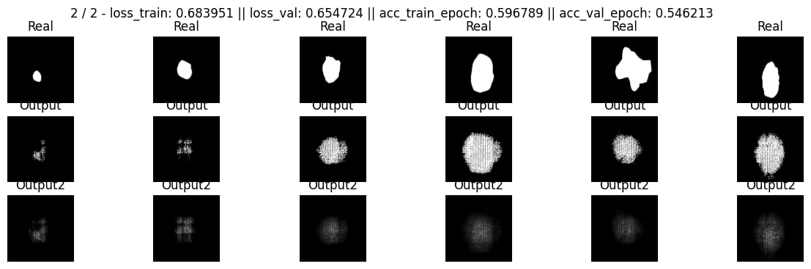

# Сегментация дефектов кожи SegNet модель

## Пайплайн обучения
1. Обучаем модель. 

1.1. Считаем ошибку и точность по каждому батчу\
1.2. Каждый раз отправляем на wandb полную ошибку\
1.3. Добавляем ошибку по батчу в одну переменную через сумму

2. Валидируем модель 

2.1. Считаем ошибку валидации по каждому батчу\
2.2. Не отправляем на wandb полную ошибку каждый батч\
2.3. Добавляем валидационную ошибку по батчу в одну переменную через сумму

3. Считаем метрики

3.1. Считаем всю ошибку за обучение \
3.2. Считаем всю ошибку за валидацию \
3.3. Отправляем ошибку за валидацию на wandb \
3.4. Считаем accuracy за обучение \
3.5. Считаем accuracy за валидацию  \
3.6. Отправляем все accuracy на wandb 

4. Выводим результаты генерации масок

4.1. Берем первый батч из лоадера\
4.2. Прогоняем по модели без градиента\
4.3. Строим плоты и выводим их

5. В САМОМ КОНЦЕ тестируем ЕДИСТВЕННЫЙ РАЗ ПОСЛЕ ОБУЧЕНИЯ

5.1. Берем первый батч из лоадера\
5.2. Прогоняем по модели без градиента\
5.3. Строим плоты и выводим их
   
## Результат работы модели
